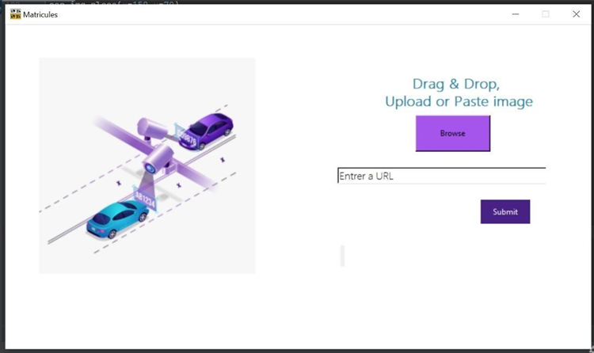
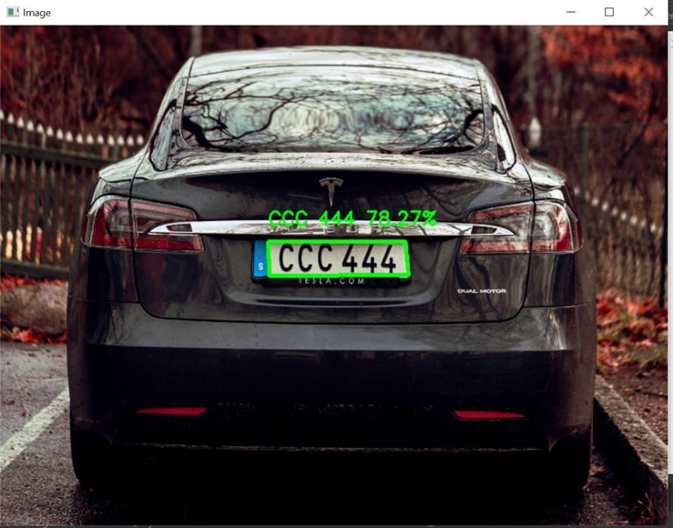

# License Plate Recognition 🚗🔍

This project is a Python-based application that uses OpenCV and EasyOCR to detect and read license plates from images. The graphical user interface (GUI) is built using Tkinter, allowing users to upload images, process them, and display the detected license plate number along with the confidence level.

## Technologies Used 🛠️

- **OpenCV-Python**: A library for computer vision and image processing. 🖼️
- **EasyOCR**: A Python package for Optical Character Recognition (OCR). 📚
- **Tkinter**: A Python library for creating graphical user interfaces (GUIs). 🖥️

## Features ✨

- **Upload Image**: Users can upload an image of a vehicle with a visible license plate. 📸
- **License Plate Detection**: The system identifies the license plate within the image using contour detection. 🔍
- **Text Recognition**: The application reads the text from the detected license plate using EasyOCR. 📝
- **Confidence Display**: The recognized text and its confidence level are displayed on the GUI. 📊

## Interface Overview 🖼️



The interface includes the following components:

- **Browse Button**: Allows users to select an image file from their system. 📂
- **Input Field**: Displays the path of the selected image file. 📁
- **Submit Button**: Triggers the detection and recognition process. 🆗
- **Result Display**: Shows the recognized license plate number and confidence level. ✅

## Results 📸

- **License Plate Image**:
  

- **Image with License Plate Contour and Text**:
  

- **Prediction Result with Confidence Percentage**:
  
  
  The result includes:
  - The predicted license plate number. 📋
  - The confidence level of the prediction. 📈

## Prerequisites 📋

To set up the project, ensure you have Python 3.x installed. 🐍

- Required Python packages:
  - `opencv-python` 🖼️
  - `easyocr` 📚
  - `tkinter` 🖥️

You can install the required packages using pip:

```bash
pip install opencv-python easyocr tkinter